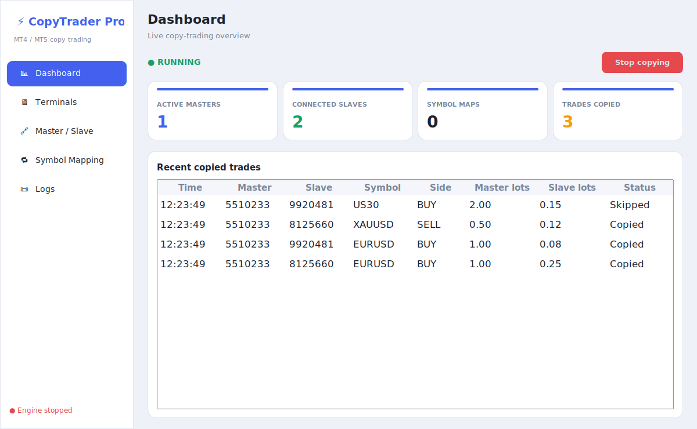

# CopyTrader Pro (prototype)

A Windows desktop **copy-trading controller** for MetaTrader 4 & 5 — in the
spirit of TraderConnects. This is the **UI prototype**: the full interface is
built and interactive, running against a stub data layer so it can be demoed
on any machine before the live trading engine is wired in.



## Features in this prototype

- **Dashboard** — engine start/stop, live stat cards, recent copied-trades table.
- **Terminals & Accounts** — "Scan" button that detects running MT4/MT5
  terminals and their logged-in accounts (stubbed with demo data for now).
- **Master / Slave** — pick **one master**, attach **multiple slaves**, and
  tune each slave independently:
  - Enable / disable
  - Lot mode: Multiplier · Fixed lot · Balance ratio · Equity ratio
  - Lot value, Reverse (mirror direction), Copy SL/TP
- **Symbol Mapping** — **auto-maps** symbols across brokers by matching the
  base instrument and ignoring common suffixes/prefixes
  (`XAUUSD` ↔ `XAUUSDz` / `XAUUSD.m` / `XAUUSD.r`, `EURUSD` ↔ `EUR/USD`).
  Names that can't be matched (e.g. `XAUUSD` vs `GOLD_CASH`) show as
  **Unmapped** and get a per-slave **manual** map. See `auto_match_symbol()`
  in `models.py`.
- **Logs** — rolling activity log.

## Run from source

```bash
pip install -r copytrader_app/requirements.txt
python run_copytrader.py
```

> On Linux you also need Tk: `sudo apt install python3-tk`.
> On Windows, Tk ships with the standard Python installer.

## Build the Windows .exe

Run **on Windows** (PyInstaller builds for the OS it runs on):

```bash
pip install -r copytrader_app/requirements.txt
python build_exe.py
```

Produces `dist/CopyTraderPro.exe` — a single-file, windowed executable.
Drop an `app.ico` next to `build_exe.py` to set a custom icon.

## Project layout

```
run_copytrader.py          # launcher / PyInstaller entry point
build_exe.py               # one-command .exe builder
copytrader_app/
  models.py                # data models + AppState (stub seed data lives here)
  connectors.py            # terminal scanner + MT4/MT5 connectors (STUBBED)
  main.py                  # window shell + sidebar navigation
  ui/                      # one module per page
    widgets.py             # theme + shared widgets (cards, tables, buttons)
    dashboard.py terminals.py masterslave.py mapping.py logs.py
```

## Going live (next phase)

The UI never touches MetaTrader directly — it only reads/writes `AppState`.
To make it trade for real, implement the stubs in `connectors.py`:

- **MT5** — use the official [`MetaTrader5`](https://pypi.org/project/MetaTrader5/)
  package. `mt5.initialize(path=...)` attaches to a specific terminal;
  `positions_get()` reads the master, `order_send()` places slave trades.
  One terminal per process, so run a worker process per `terminal_path`.
- **MT4** — no official API. Ship a small Expert Advisor (EA) "bridge" inside
  each MT4 terminal that exchanges JSON over files or a local socket.
- **Detection** — replace `scan_terminals()` with a `psutil` process scan for
  `terminal64.exe` / `terminal.exe` and read each terminal's logged-in account.
- **Copy engine** — a loop that diffs master positions, applies the symbol map
  + per-slave lot rules, and sends orders to each enabled slave.

> ⚠️ Copy-trade only accounts you own or are authorized to operate.
